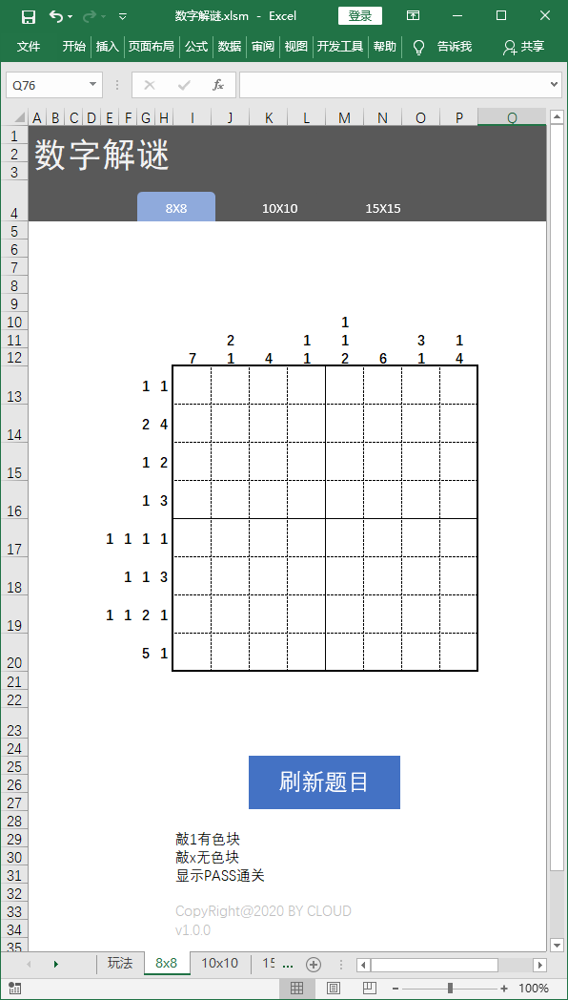
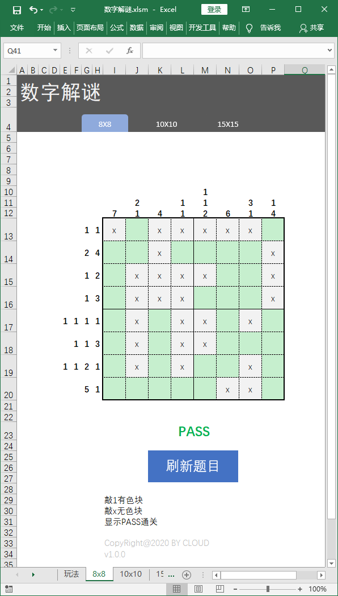
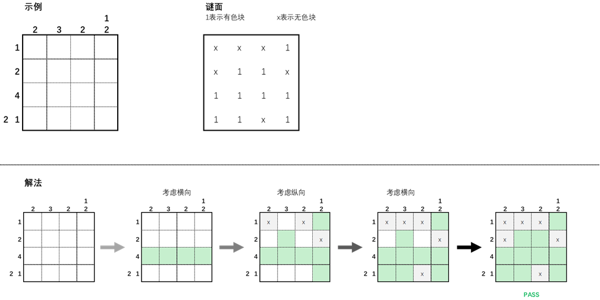
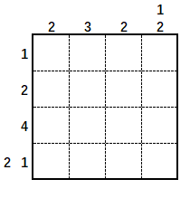

# Digital-puzzle
## Excel版的数字解谜游戏，需要用到VBA

## 游戏界面
|初始界面|解答完成|
| ---- | ---- |
|  |  |

## 玩法介绍

* 操作：游戏矩阵内 单元格输入<kbd>1</kbd>有色块；输入<kbd>x</kbd>无色块
* 提示：选中一块区域后，敲<kbd>1</kbd>，再敲<kbd>Ctrl</kbd>+<kbd>Enter</kbd>可以一次填充整块区域

## 演示

## 下载

[数字解谜.xlsm](https://github.com/beanjeally/Digital-puzzle/raw/master/%E6%95%B0%E5%AD%97%E8%A7%A3%E8%B0%9C.xlsm)
